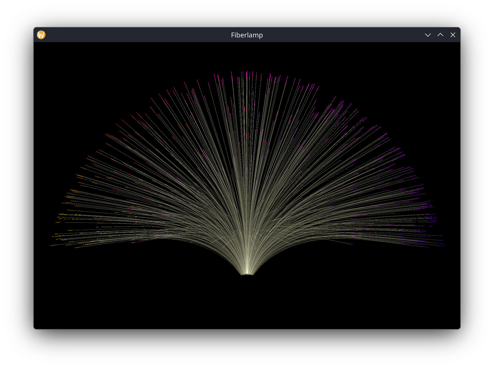

# fiberlamp-rs

A modern Rust reimplementation of the classic xscreensaver `fiberlamp` using wgpu for GPU-accelerated rendering. Simulates a fiber optic lamp with realistic physics and glowing fiber tips.




## Features

- **GPU-accelerated rendering** via wgpu (Vulkan, Metal, DX12 backends)
- **Native Wayland support** - works with KDE [plasma-wallpaper-application](https://invent.kde.org/dos/plasma-wallpaper-application)
- **Realistic physics simulation** - cantilever beam model with periodic perturbations
- **Smooth 60fps** on integrated GPUs
- **MSAA anti-aliasing** - optional 2x, 4x, or 8x multisampling
- **Configurable parameters** - fiber count, color palette size, MSAA level

## Installation

### From Source

Requires Rust 1.85+ (2024 edition).

```bash
git clone https://github.com/jtcressy/fiberlamp-rs.git
cd fiberlamp-rs
cargo build --release
```

This is a monorepo containing multiple crates. The main standalone application binary will be at `target/release/fiberlamp-bin` (or `fiberlamp-bin.exe` on Windows).

### Dependencies

On Linux, you may need to install Vulkan drivers:

```bash
# Fedora/RHEL
sudo dnf install vulkan-loader mesa-vulkan-drivers

# Ubuntu/Debian
sudo apt install libvulkan1 mesa-vulkan-drivers

# Arch
sudo pacman -S vulkan-icd-loader vulkan-mesa-layers
```

## Usage

### Standalone Application (fiberlamp-bin)

Build and run the standalone application:

```bash
# Build the standalone app
cargo build -p fiberlamp-bin --release

# Run fullscreen (default)
./target/release/fiberlamp-bin

# Run in a window
./target/release/fiberlamp-bin --windowed

# Custom fiber count (10-500)
./target/release/fiberlamp-bin --count 300

# Enable 4x MSAA anti-aliasing
./target/release/fiberlamp-bin --msaa 4

# All options
./target/release/fiberlamp-bin --help
```

### Command Line Options

| Option | Short | Default | Description |
|--------|-------|---------|-------------|
| `--count` | `-c` | 500 | Number of fibers (10-500) |
| `--delay` | `-d` | 16 | Frame delay in milliseconds |
| `--ncolors` | `-n` | 64 | Number of colors in the palette |
| `--windowed` | `-w` | false | Run in windowed mode |
| `--msaa` | `-m` | 1 | MSAA sample count (1=off, 2, 4, or 8) |

### Controls

- **Escape** or **Q** - Exit

### Wayland Usage

For native Wayland rendering:

```bash
WAYLAND_DISPLAY=wayland-0 ./fiberlamp-rs
```

### Platform-Specific Builds

#### macOS Screensaver

Build the macOS screensaver bundle:

```bash
cd fiberlamp-macos
./macos-screensaver/build.sh
```

#### KDE Plasma Wallpaper

To use as an animated wallpaper with KDE Plasma, install the [Application Wallpaper](https://store.kde.org/p/2318884/) plugin ([source](https://invent.kde.org/dos/plasma-wallpaper-application)):

1. Install the plugin via KDE Discover, KDE Store, or build from source
2. Build the standalone app: `cargo build -p fiberlamp-bin --release`
3. Right-click desktop → Configure Desktop and Wallpaper
4. Select "Application Wallpaper" as the wallpaper type
5. Set the application path to your `target/release/fiberlamp-bin` binary
6. The application will fill the desktop surface

## Project Structure

This is a Cargo workspace containing multiple crates:

```
fiberlamp-rs/
├── Cargo.toml                 # Workspace root
├── fiberlamp-core/            # Core physics & rendering library
│   ├── Cargo.toml
│   └── src/
│       ├── lib.rs            # Library root
│       ├── physics.rs        # Fiber simulation & cantilever beam physics
│       ├── renderer.rs       # wgpu pipeline setup, MSAA support
│       ├── vertex.rs         # Vertex triangulation, color palettes
│       └── shaders/
│           └── fiber.wgsl    # GPU shader (passthrough, pre-transformed)
├── fiberlamp-bin/             # Standalone windowed application
│   ├── Cargo.toml
│   └── src/
│       ├── main.rs           # Event loop, window management (winit)
│       └── cli.rs            # CLI argument parsing
├── fiberlamp-macos/           # macOS screensaver bundle
│   ├── Cargo.toml
│   ├── src/
│   │   └── lib.rs            # FFI bindings for macOS
│   └── macos-screensaver/
│       ├── FiberlampView.m   # Objective-C screensaver view
│       └── build.sh          # Build script for .saver bundle
└── fiberlamp-kde/             # KDE Plasma wallpaper plugin (coming soon)
    └── Cargo.toml
```

### Crate Responsibilities

- **fiberlamp-core**: Pure simulation and rendering logic. Platform-agnostic, no windowing code.
- **fiberlamp-bin**: Event loop and window management via `winit`. Calls `fiberlamp-core` for physics/rendering.
- **fiberlamp-macos**: FFI layer to expose `fiberlamp-core` to Objective-C macOS screensaver code.
- **fiberlamp-kde**: KDE Plasma wallpaper plugin integration (planned).

## How It Works

### Physics Simulation

Each fiber is modeled as a chain of 20 connected nodes using cantilever beam physics:

- **Node 0** is pinned at the lamp's center
- **Nodes 1-19** move freely with angular spring forces
- **Euler integration** updates angular velocities and positions
- **Periodic bumps** (~every 10,000 frames) perturb the base, causing natural swaying
- **Geometric rotation** slowly rotates the entire lamp (~10°/minute)

### Rendering

- Fibers are triangulated into screen-space quads (wgpu doesn't support line width)
- **Body segments** use 3-tier depth coloring (dim/medium/bright based on z-depth)
- **Tip segments** use a rotating HSV color palette
- **Additive blending** creates the characteristic glow effect
- Fixed 60Hz physics with variable render rate

## Building for Development

### Workspace-Level Commands

```bash
# Build all crates (debug)
cargo build

# Build all crates (release)
cargo build --release

# Run all tests
cargo test

# Run with logging
RUST_LOG=info cargo run -p fiberlamp-bin
```

### Per-Crate Commands

```bash
# Build core library
cargo build -p fiberlamp-core

# Test core library
cargo test -p fiberlamp-core

# Build standalone app
cargo build -p fiberlamp-bin --release

# Run standalone app with logging
RUST_LOG=info cargo run -p fiberlamp-bin

# Run specific test
cargo test -p fiberlamp-core test_fiber_creation

# Build macOS screensaver
cd fiberlamp-macos && ./macos-screensaver/build.sh
```

## Credits

### Original xscreensaver fiberlamp

This project is a reimplementation of the original `fiberlamp` screensaver:

- **Author:** Tim Auckland (tda10.geo@yahoo.com)
- **Copyright:** 2005
- **Source:** [xscreensaver/hacks/fiberlamp.c](https://github.com/Zygo/xscreensaver/blob/master/hacks/fiberlamp.c)

The original was written in C using Xlib. This Rust version faithfully recreates the physics simulation while using modern GPU rendering via wgpu.

### xscreensaver

[xscreensaver](https://www.jwz.org/xscreensaver/) is a collection of screen savers by Jamie Zawinski and many contributors. It has been the standard screen saver collection on Unix systems since 1992.

## License

This project is licensed under the MIT License - see the [LICENSE](LICENSE) file for details.

The original xscreensaver fiberlamp by Tim Auckland was released under a permissive license allowing use, modification, and distribution.
